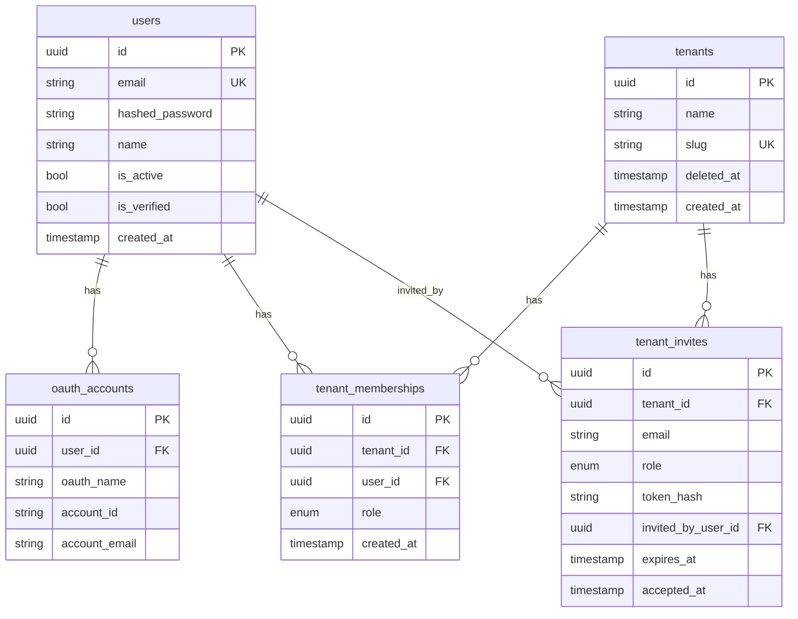
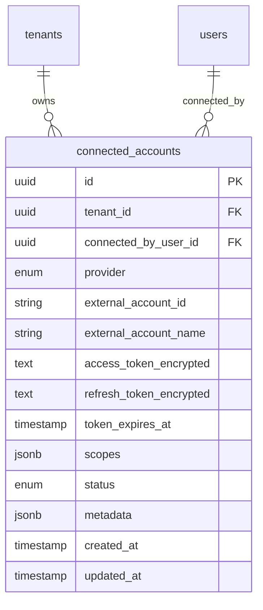

# Propel backend data model

Canonical reference for entity relationships in the Propel API database. The v1 schema covers **users, login OAuth, tenants, memberships, and invites**. Tool integrations (`connected_accounts`) are planned for v2.

## v1 entities

| Entity | Table | Description |
|---|---|---|
| User | `users` | A person with a Propel account (email/password and/or login OAuth) |
| OAuthAccount | `oauth_accounts` | Login provider link (Google, GitHub) — identity only, not tool tokens |
| Tenant | `tenants` | An onboarded organization |
| TenantMembership | `tenant_memberships` | Join table: which users belong to which tenants and their role |
| TenantInvite | `tenant_invites` | Pending invitation to join a tenant |

## v1 ER diagram

## Relationship rules

| Relationship | Cardinality | Notes |
|---|---|---|
| User → OAuthAccount | 1:N | One user can link multiple login providers; unique on `(oauth_name, account_id)` |
| User ↔ Tenant | M:N via `tenant_memberships` | A user can belong to multiple tenants; a tenant has many users |
| Tenant → TenantMembership | 1:N | Membership is the source of truth for tenant access |
| User → TenantMembership | 1:N | Role (`admin`, `manager`, `individual`) lives on the membership, not the user |
| Tenant → TenantInvite | 1:N | Invites are tenant-scoped; unique pending invite per `(tenant_id, email)` |
| User → TenantInvite (invited_by) | 1:N | Audit trail; nullable FK with `ON DELETE SET NULL` |

## Integrity rules

- **`tenant_memberships`**: unique `(tenant_id, user_id)` — one role per user per tenant
- **`tenants.slug`**: globally unique; used in URLs; API returns `409` on conflict
- **`tenants.deleted_at`**: soft delete; memberships remain but tenant is hidden from listings
- **`tenant_invites.token_hash`**: unique; raw token never stored (SHA-256 hash only)
- **Last-admin guard**: application logic prevents removing or demoting the sole admin (not a DB constraint)

## Roles and permissions

| Action | Admin | Manager | Individual |
|---|---|---|---|
| Create tenant (becomes admin) | yes | yes | yes |
| Update / delete tenant | yes | no | no |
| List / view members | yes | yes | yes |
| Invite **admin** | yes | no | no |
| Invite **manager** or **individual** | yes | yes | no |
| Assign / change roles | yes | no | no |
| Remove members | yes | no | no |

Enforced in `backend/app/auth/permissions.py` and FastAPI dependencies.

## Login OAuth vs tool connections

| Concern | Table (v1) | Purpose |
|---|---|---|
| **Sign-in** | `oauth_accounts` | Authenticate the Propel user via Google/GitHub |
| **Tool connections** | `connected_accounts` (v2) | Authorize Propel to read/write third-party accounts on behalf of a tenant |

Signing in with GitHub does **not** automatically connect the tenant's GitHub org. Those are separate user actions with different OAuth apps/scopes.

## v2 planned: `connected_accounts`

Not migrated yet. Reserved API namespace: `/api/v1/tenants/{tenant_id}/connections`.

The `IntegrationProvider` enum stub lives in `backend/app/models/enums.py` (`github`, `linear`, `jira`, `slack`, `cursor`, …).

## Related docs

- [Backend README](../../backend/README.md) — API endpoints and local setup
- [Backend service](../backend/README.md) — FastAPI application
