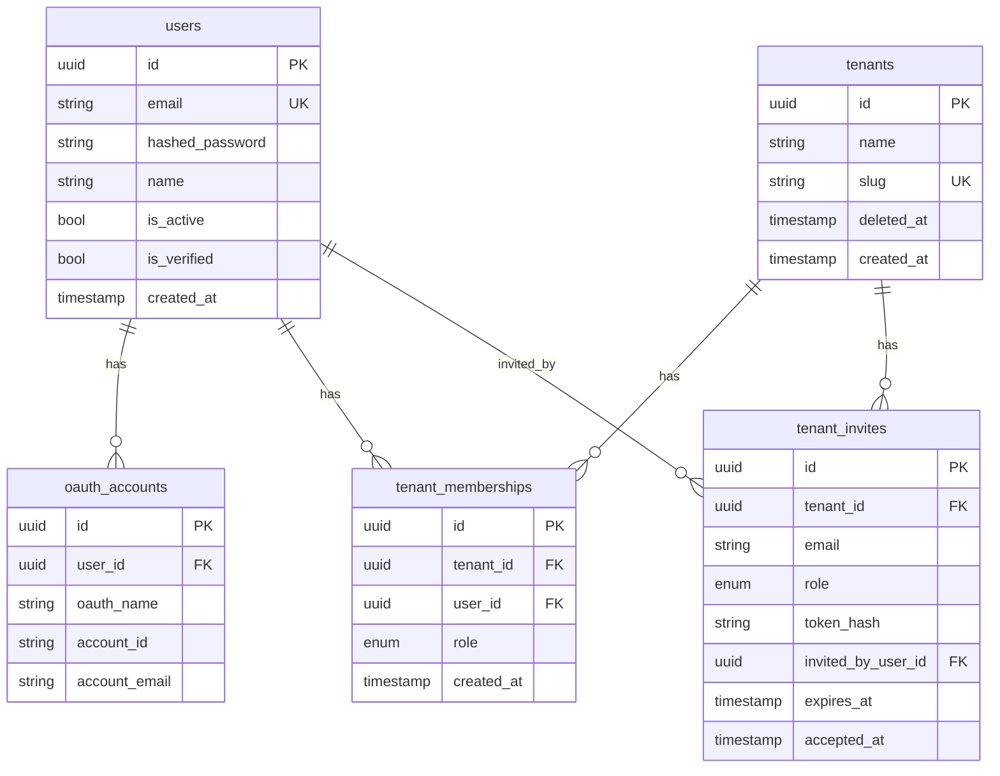
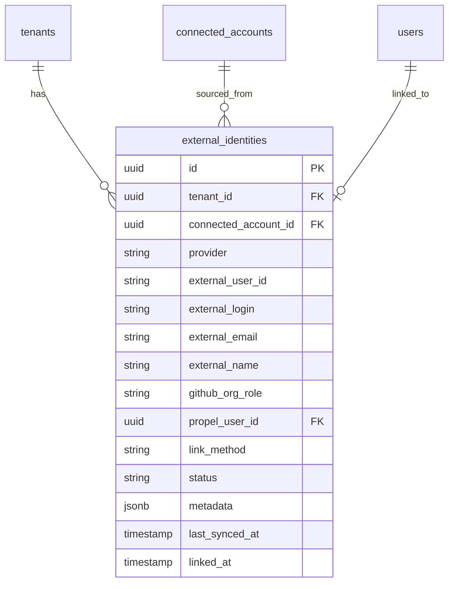

# Propel backend data model

Canonical reference for entity relationships in the Propel API database. The v1 schema covers **users, login OAuth, tenants, memberships, and invites**. The ingestion layer (migration `002`) adds **`connected_accounts`, `raw_record`, `datapoint`, and `ingestion_run`** for landing external data (see [ingestion overview](#ingestion-entities-migration-002)).

## v1 entities

| Entity | Table | Description |
|---|---|---|
| User | `users` | A person with a Propel account (email/password and/or login OAuth) |
| OAuthAccount | `oauth_accounts` | Login provider link (Google, GitHub) — identity only, not tool tokens |
| Tenant | `tenants` | An onboarded organization |
| TenantMembership | `tenant_memberships` | Join table: which users belong to which tenants and their role |
| TenantInvite | `tenant_invites` | Pending invitation to join a tenant |

## v1 ER diagram

## Relationship rules

| Relationship | Cardinality | Notes |
|---|---|---|
| User → OAuthAccount | 1:N | One user can link multiple login providers; unique on `(oauth_name, account_id)` |
| User ↔ Tenant | M:N via `tenant_memberships` | A user can belong to multiple tenants; a tenant has many users |
| Tenant → TenantMembership | 1:N | Membership is the source of truth for tenant access |
| User → TenantMembership | 1:N | Role (`admin`, `manager`, `individual`) lives on the membership, not the user |
| Tenant → TenantInvite | 1:N | Invites are tenant-scoped; unique pending invite per `(tenant_id, email)` |
| User → TenantInvite (invited_by) | 1:N | Audit trail; nullable FK with `ON DELETE SET NULL` |

## Integrity rules

- **`tenant_memberships`**: unique `(tenant_id, user_id)` — one role per user per tenant
- **`tenants.slug`**: globally unique; used in URLs; API returns `409` on conflict
- **`tenants.deleted_at`**: soft delete; memberships remain but tenant is hidden from listings
- **`tenant_invites.token_hash`**: unique; raw token never stored (SHA-256 hash only)
- **Last-admin guard**: application logic prevents removing or demoting the sole admin (not a DB constraint)

## Roles and permissions

| Action | Admin | Manager | Individual |
|---|---|---|---|
| Create tenant (becomes admin) | yes | yes | yes |
| Update / delete tenant | yes | no | no |
| List / view members | yes | yes | yes |
| Invite **admin** | yes | no | no |
| Invite **manager** or **individual** | yes | yes | no |
| Assign / change roles | yes | no | no |
| Remove members | yes | no | no |

Enforced in `backend/app/auth/permissions.py` and FastAPI dependencies.

## Login OAuth vs tool connections

| Concern | Table (v1) | Purpose |
|---|---|---|
| **Sign-in** | `oauth_accounts` | Authenticate the Propel user via Google/GitHub |
| **Tool connections** | `connected_accounts` (v2) | Authorize Propel to read/write third-party accounts on behalf of a tenant |

Signing in with GitHub does **not** automatically connect the tenant's GitHub org. Those are separate user actions with different OAuth apps/scopes. Tenant tool connections live in `connected_accounts` (below), and for GitHub specifically a tenant admin installs the **GitHub App** (not the login OAuth app) via `/api/v1/tenants/{tenant_id}/connections/github/install`.

The browser SPA signs in / signs up through a server-side OIDC **backend-for-frontend (BFF)** flow over Zitadel (`app/routers/auth.py`). `GET /api/v1/auth/login` redirects the browser to Zitadel's hosted Login UI v2; the user authenticates there (optionally via the GitHub IdP configured on the Zitadel instance) and Zitadel redirects back to `GET /api/v1/auth/callback`. The callback completes the OIDC code exchange (Authlib), just-in-time provisions the user + tenant (`app/auth/reconcile.py`), and establishes a server-side **httpOnly cookie session** signed with `SESSION_SECRET` — no token is exposed to JavaScript. `GET /api/v1/auth/logout` clears the cookie and ends the Zitadel session; `GET /api/v1/auth/me` returns the current user. GitHub is involved only as a Zitadel IdP and for self-service account linking (`GET /api/v1/auth/github/link/authorize` + `/callback`, see `app/services/github_link.py`), which reuses the ingestion **GitHub App**'s user-OAuth credentials (`GITHUB_APP_CLIENT_ID`/`GITHUB_APP_CLIENT_SECRET`). Login (user-to-server OAuth) is still distinct from the App **installation** that authorizes org data ingestion.

## Ingestion entities (migration `002`)

V1 ingestion is **landing only**: Meltano (`tap-github` → custom `target-propel`) pulls provider data and writes it to Postgres. No transforms run at ingest — that is a later dbt layer. See the [backend README](../../backend/README.md#ingestion-v1--landing-only) for how runs are driven.

| Entity | Table | Description |
|---|---|---|
| ConnectedAccount | `connected_accounts` | A tenant's link to a source. GitHub App installs use `auth_type='github_app_installation'`; future OAuth tools use `auth_type='oauth'` with encrypted tokens. |
| RawRecord | `raw_record` | Append-only landing of the provider payload exactly as fetched (audit + replay + lineage). |
| Datapoint | `datapoint` | Normalized, source-agnostic envelope (who/when/what + pointer to `raw_record`). Generic at ingest; provider detail stays in `raw_record.payload` and a passthrough `metadata`. |
| IngestionRun | `ingestion_run` | One row per `(connected_account, resource_type)` run: counts, status, error, and incremental `cursor`. |

```mermaid
erDiagram
    tenants ||--o{ connected_accounts : owns
    users ||--o{ connected_accounts : connected_by
    connected_accounts ||--o{ ingestion_run : runs
    ingestion_run ||--o{ raw_record : produces
    raw_record ||--o| datapoint : lineage

    connected_accounts {
        uuid id PK
        uuid tenant_id FK
        uuid connected_by_user_id FK
        string provider
        string auth_type
        string external_account_id
        string external_account_name
        text access_token_encrypted
        text refresh_token_encrypted
        timestamp token_expires_at
        jsonb scopes
        string status
        jsonb metadata
        timestamp created_at
        timestamp updated_at
    }

    raw_record {
        uuid id PK
        uuid tenant_id
        string source
        string resource_type
        string source_id
        jsonb payload
        timestamp fetched_at
        uuid run_id
    }

    datapoint {
        uuid id PK
        uuid tenant_id
        string source
        string tool
        string kind
        string name
        string subject_type
        string subject_id
        timestamp occurred_at
        timestamp period_start
        timestamp period_end
        timestamp observed_at
        string source_key
        jsonb metadata
        uuid raw_record_id
        timestamp created_at
    }

    ingestion_run {
        uuid id PK
        uuid tenant_id
        uuid connected_account_id FK
        string source
        string resource_type
        timestamp started_at
        timestamp finished_at
        string status
        int records_pulled
        int datapoints_written
        jsonb cursor
        text error
    }
```

`provider`, `auth_type`, `status`, `kind`, etc. are stored as **text** (not Postgres enums) so new sources and resource types land without a migration. The matching `StrEnum`s for app-level use live in `backend/app/models/enums.py` (`IntegrationProvider`, `AuthType`, `ConnectionStatus`, `DatapointKind`, `IngestionRunStatus`).

### Ingestion integrity rules

- **`connected_accounts`**: unique `(tenant_id, provider, external_account_id)`. GitHub App installs store the `installation_id` in `external_account_id`; tokens are minted per run and never persisted for app installs.
- **`datapoint` events**: partial unique index `datapoint_event_uq (tenant_id, source, source_key) where kind='event'`. Re-fetching an event is a no-op (`ON CONFLICT DO NOTHING`).
- **`datapoint` measurements**: partial unique index `datapoint_measure_uq (tenant_id, tool, name, subject_id, period_start) where kind='measurement'`. Restatements upsert, but only when the incoming `observed_at` is newer (newest-wins) — this is what prevents double-counting when a provider republishes a period.
- **`raw_record`**: never deduped or updated; dedup/restatement is resolved only at the `datapoint` layer.

## GitHub identity linking (migration `003`)

Ingestion also pulls the connected org's **member roster** and links each GitHub member to a Propel user. Two extra Meltano jobs land the data — `github_org_sync` (the `organization_members` stream) and `github_user_profiles_sync` (the `users` stream for names/emails) — and the `github_identity` service reconciles it into a new bridge table.

| Entity | Table | Description |
|---|---|---|
| ExternalIdentity | `external_identities` | One row per GitHub org member, scoped to a tenant's connected account. Bridges a GitHub user (`external_user_id` / `external_login`) to a Propel `users.id`. This is identity *linkage*, not user-record merging. |

### Linking rules

After each sync, every unlinked identity is resolved in priority order:

1. **GitHub OAuth id (certain):** matches `oauth_accounts.account_id` for `oauth_name='github'` → `link_method='oauth_id'`.
2. **Exact email (certain):** matches an existing `users.email` (case-insensitive) → `link_method='email'`.
3. **Auto-provision:** no match but the member's public email is known → a Propel `users` row is created (unusable password; sign-in via GitHub OAuth or a future invite) → `link_method='provisioned'`.
4. **Pending:** no email and no match → `status='pending_email'`. The link is claimed later when the member signs in with GitHub, or when an already-registered user clicks **Connect with GitHub** on their profile. Both paths establish a GitHub `oauth_accounts` row and then call `link_oauth_identity`, which attaches every matching pending identity (across tenants) by GitHub user id and ensures the member's tenant membership/role. This is the self-service fix for members whose GitHub email is private or differs from their Propel email, so org sync alone never linked them. The endpoints are `GET /api/v1/auth/github/link/authorize` and `GET /api/v1/auth/github/link/callback` (see `app/services/github_link.py`).

Each linked or provisioned member gets a `tenant_memberships` row. **Role mapping:** a GitHub org **owner** (the `admin` role from `GET /orgs/{org}/members?role=admin`) becomes a Propel `admin`; everyone else is `individual`. Roles are reconciled on every sync (GitHub is the source of truth), except the **last admin is never demoted** — the same guard used elsewhere in membership management.

### Integrity rules

- **`external_identities`**: unique `(tenant_id, provider, external_user_id)` and unique `(tenant_id, provider, external_login)`. A partial unique index `uq_external_identity_propel_user (tenant_id, provider, propel_user_id) where propel_user_id is not null` ensures at most one GitHub identity per Propel user per tenant.
- The `organization_members` stream only exposes `id`, `login`, and `avatar_url`; `name`/`email` come from the `users` stream and only when the member has a public email — which is why many members provision or stay `pending_email`.
- The ingestion GitHub App must grant **Organization permissions → Members: Read-only** for `github_org_sync` and the admin-role lookup to succeed.

The matching `StrEnum`s (`GitHubOrgRole`, `IdentityLinkMethod`, `IdentityStatus`) live in `backend/app/models/enums.py`.

## Related docs

- [Backend README](../../backend/README.md) — API endpoints and local setup
- [Backend service](../backend/README.md) — FastAPI application
